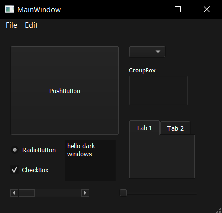
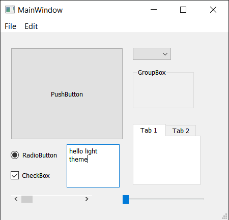

# qt-winDark
QT: Dark and Light window theme based on Windows 10 setting

 .

**Warning:** this is not considered a proper solution, and Windows 10 api can change !!

* Title bar - Based on https://github.com/statiolake/neovim-qt/commit/da8eaba7f0e38b6b51f3bacd02a8cc2d1f7a34d8

* Stylesheet - based on https://forum.qt.io/post/523388
